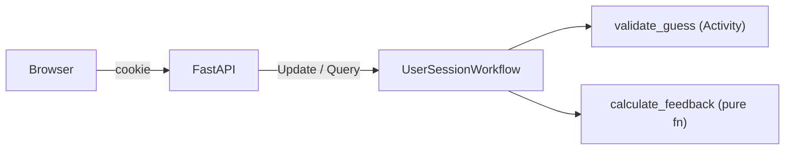

# CLAUDE.md

This file provides guidance to Claude Code (claude.ai/code) when working with code in this repository.

## Project

Durable Wordle — a Wordle clone where each game session is a Temporal workflow. No database; the workflow *is* the state. Built as a conference demo teaching five Temporal concepts: start_workflow, Updates, Activities, durability, and workflow completion.

## Stack

- **Backend**: Temporal Python SDK (`temporalio`), FastAPI, Jinja2
- **Frontend**: HTMX, Tailwind CSS (CDN)
- **Package management**: uv
- **Task runner**: just
- **Deployment**: Docker Compose with Temporal dev server

## Commands

```bash
just check      # lint + typecheck + test (the gate)
just test       # uv run pytest
just lint       # uv run ruff check src/ tests/
just typecheck  # uv run mypy src/
just format     # uv run ruff format src/ tests/
just worker     # start Temporal worker
just server     # start FastAPI dev server (uvicorn --reload)
```

Run a single test: `uv run pytest tests/test_game_logic.py::test_name -v`

## Architecture



- **One workflow per game session**: cookie holds session_id (UUID), workflow ID = `wordle-{date}-{session_id}`
- **Update handler** (`make_guess`): validates guess, runs activity, computes feedback, mutates state, returns result
- **Query handler** (`get_game_state`): returns current board state for rendering (read-only)
- **Activity** (`validate_guess`): checks word against bundled list (sync activity, file I/O = side effect)
- **Pure function** (`calculate_feedback`): green/yellow/gray logic with duplicate-letter handling
- **Word selection**: `random.seed(date.toordinal())` — deterministic daily word, zero external deps

## Temporal Constraints

- Workflow code must be deterministic — no I/O, no `datetime.now()` (use `workflow.now()`), no `random` (use `workflow.random()`)
- Import activities in workflows with `workflow.unsafe.imports_passed_through()`
- Workflow and activity inputs use single dataclass pattern
- Update validators must not mutate state or block
- Sync activities require `ThreadPoolExecutor` on the worker

## Code Conventions

- `src/durable_wordle/` layout — workflows.py and activities.py in separate files (SDK sandbox requirement)
- All files start with 2-line ABOUTME comment (first line prefixed `ABOUTME: `)
- Strict mypy — no `Any` types
- Type hints on all functions, parameters, and return types
- `X | None` over `Optional[X]` (PEP 604, Python 3.12+)
- RST-format docstrings on all public interfaces
- Absolute imports only — no relative imports
- Empty `__init__.py` files — never add content to them
- Descriptive variable names — no single-letter names (`i`, `j`, `x`); use `line_index`, `letter_index`, etc.
- Use method references for queries/updates, not string names
- Config via `DURABLE_WORDLE_TEMPORAL_HOST`, `DURABLE_WORDLE_TEMPORAL_NAMESPACE`, `DURABLE_WORDLE_TEMPORAL_TASK_QUEUE` env vars

## Testing

- **Workflow tests**: `WorkflowEnvironment.start_local()` with real activities, unique `uuid4()` task queues per test
- **Activity tests**: `ActivityEnvironment` for isolated activity testing
- **API tests**: FastAPI `TestClient` with test Temporal environment (fixtures in `tests/conftest.py`)
- **Pure logic**: direct unit tests for `calculate_feedback` and word lists
- pytest-asyncio with `asyncio_mode = "auto"`
