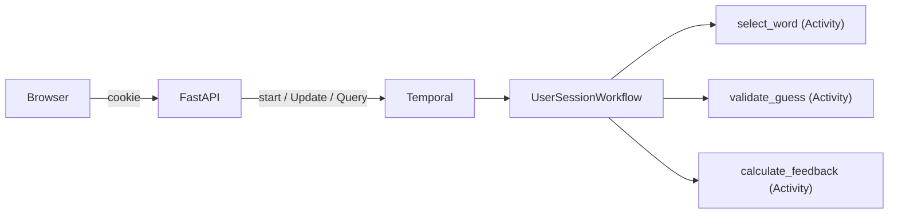

# CLAUDE.md

This file provides guidance to Claude Code (claude.ai/code) when working with code in this repository.

## Project

Durable Wordle — a Wordle clone where each game session is a Temporal workflow. No database; the workflow *is* the state. Built as a conference demo teaching five Temporal concepts: start_workflow, Updates, Activities, durability, and workflow completion.

**Design principle**: The workflow must be the complete game — fully playable via Temporal CLI (`temporal workflow start/update/query`) without the web UI. The API is just a UI skin. Never put game logic in the API layer.

## Stack

- **Backend**: Temporal Python SDK (`temporalio`), FastAPI, Jinja2
- **Frontend**: HTMX, Tailwind CSS (CDN), Space Mono font
- **Package management**: uv
- **Task runner**: just
- **Deployment**: Docker Compose with Temporal dev server

## Commands

```bash
just check      # lint + typecheck + test (the gate; excludes e2e)
just test-e2e   # full-stack browser smoke tests (Playwright; needs temporal + chromium)
just test       # uv run pytest
just lint       # uv run ruff check src/ tests/
just typecheck  # uv run mypy src/
just format     # uv run ruff format src/ tests/
just dev        # start Temporal server + worker + FastAPI UI together (one command)
just booth      # like `just dev`, plus launch Firefox kiosks for the game + display
just worker     # start Temporal worker
just server     # start Temporal local dev server (temporal server start-dev)
just ui         # start FastAPI dev server (uvicorn --reload)
```

Run a single test: `uv run pytest tests/test_game_logic.py::test_name -v`

**Tip**: Run `just format` before `just check` after writing new files — auto-fixes line-length issues and avoids a manual edit round-trip.

## Architecture


```mermaid
flowchart LR
    Browser -->|cookie| FastAPI
    FastAPI -->|start / Update / Query| Temporal
    Temporal --> UserSessionWorkflow
    UserSessionWorkflow --> select_word["select_word (Activity)"]
    UserSessionWorkflow --> validate_guess["validate_guess (Activity)"]
    UserSessionWorkflow --> calculate_feedback["calculate_feedback (Activity)"]
```

### Screens (SPA)

The app is a single-page SPA. `<main id="screen">` is the HTMX swap target. Three screens:

1. **Start screen** (`_start_screen.html`) — madlib form (first name, last name, email, noun, verb) + PLAY button. Shown when no active workflow exists for the session.
2. **Game screen** (`_game_screen.html`) — wraps the board partial; rendered on `POST /play` and `GET /`.
3. **Leaderboard screen** (`_leaderboard_screen.html`) — top-25 table with date header and madlib cycling; shown on `POST /leaderboard` and `GET /leaderboard-screen`.

### Cookie lifecycle

| Cookie | Set by | Cleared by | Purpose |
|---|---|---|---|
| `session_id` | `GET /` (new session) or `POST /play` | `GET /new-game` | Links browser to workflow |
| `game_id` | `POST /play` (random mode) or `GET /new-game` | `POST /play` (daily mode) | Identifies random-mode workflow |
| `player_name` | `POST /play` | — | Displayed on leaderboard |
| `email` | `POST /play` | — | Stored in DB for prize outreach (not shown publicly) |
| `madlib_noun` | `POST /play` | — | Cycling leaderboard phrase |
| `madlib_verb` | `POST /play` | — | Cycling leaderboard phrase |

**Critical invariant**: `POST /play` in daily mode must call `response.delete_cookie("game_id")` to clear any stale `game_id` left by `GET /new-game`. Without this, `POST /leaderboard` builds a `wordle-random-*` workflow ID and fails to find the daily game.

### Workflow IDs

- Daily: `wordle-{YYYY-MM-DD}-{session_id}`
- Random: `wordle-random-{game_id}`

`get_workflow_id(session_id, game_date, game_id)` in `api.py` is the single source of truth.

### Routing

| Route | Description |
|---|---|
| `GET /` | Full page — start screen or game screen depending on active workflow |
| `POST /play` | Start/resume workflow, store madlib/name cookies, return game screen fragment |
| `POST /guess` | Send guess via workflow Update, return board partial fragment |
| `GET /new-game` | Clear cookies and redirect to `/` (sets new random `game_id`) |
| `POST /leaderboard` | Query won game, save entry to SQLite (with email + game_date), return leaderboard fragment |
| `GET /leaderboard-screen` | Return leaderboard fragment (no submission) |
| `GET /health` | Health check |

## Key Modules

- **`models.py`**: `WORD_LENGTH = 5` constant; `LetterFeedback` enum (CORRECT/PRESENT/ABSENT); `GuessResult`, `GameState`, `WorkflowInput`, `MakeGuessInput`, `ValidateGuessInput`, `SelectWordInput`, `CalculateFeedbackInput`
- **`workflow.py`**: `UserSessionWorkflow` — `run()` selects word via activity then waits, `make_guess` Update handler with `wait_condition` guard for init race, `validate_make_guess` validator uses `WORD_LENGTH`, `get_game_state` Query handler
- **`activities.py`**: Three sync activities — `validate_guess` (checks `VALID_GUESSES` frozenset first, falls back to dictionary API via `requests`), `select_word` (daily date-seeded or random), `calculate_feedback` (two-pass algorithm, normalizes inputs to uppercase)
- **`leaderboard.py`**: SQLite-backed leaderboard at `data/leaderboard.db`. `TOP_N = 25`. Entries are scoped by `game_date` for daily resets. `add_entry(player_name, email, guesses, started_at, madlib_noun, madlib_verb, game_date)` inserts and returns top entries. `get_top_entries_for_date(game_date, n=TOP_N)` returns the top N for display. `get_entries_for_date(game_date)` returns ALL entries including email for prize outreach. `get_madlib_pairs(entries)` returns deduplicated `[noun, verb]` pairs. Schema initialized lazily via `_ensure_schema()` with `_schema_ready` flag.
- **`api.py`**: `create_app()` factory — FastAPI with cookie sessions, Temporal client lifecycle via lifespan. `_session_from_request(request)` extracts `(session_id, is_new_session, game_id)` — used in `GET /`, `POST /play`, `POST /guess`. `_wait_for_game_state()` retries up to 100×0.1s (10s) to handle the `select_word` activity init window.
- **`worker.py`**: Temporal worker entry point — connects via `temporalio.envconfig`, registers workflow and all three activities, uses `ThreadPoolExecutor` for sync activities
- **`word_lists.py`**: `ANSWER_LIST` (curated ~300 words), `VALID_GUESSES` (frozenset, includes extended words), `get_daily_word(date)` (date-seeded), `is_valid_guess(word)`

## Temporal Constraints

- Workflow code must be deterministic — no I/O, no `datetime.now()` (use `workflow.now()`), no `random` (use `workflow.random()`)
- Import activities and models in workflows with `workflow.unsafe.imports_passed_through()`
- Workflow and activity inputs use single dataclass pattern
- Enums in workflow/activity data types must use `StrEnum` or `IntEnum` — the default data converter silently fails with `(str, Enum)`
- Update validators must not mutate state, must not block, cannot be async, cannot call activities
- When workflow has async initialization (activity call before `wait_condition`), update handlers must guard with `await workflow.wait_condition(lambda: self._game_state is not None)`
- `WorkflowUpdateFailedError` wraps the real error in `__cause__` — use `str(err.__cause__)` to extract the actual `ApplicationError` message
- For `temporalio.envconfig`, use `ClientConfigProfile.load(config_source=Path(...))` — `str` is treated as TOML content, `Path` as a file path. Project uses `temporal.toml` at repo root
- Sync activities require `ThreadPoolExecutor` on the worker
- Querying a completed workflow still works (status `COMPLETED` in `_query_existing_game`) — used by `POST /leaderboard` to verify the game was won

## Code Conventions

- `src/durable_wordle/` layout — workflow.py and activities.py in separate files (SDK sandbox requirement)
- All files start with 2-line ABOUTME comment (first line prefixed `ABOUTME: `)
- Strict mypy — no `Any` types
- Type hints on all functions, parameters, and return types
- `X | None` over `Optional[X]` (PEP 604, Python 3.12+)
- RST-format docstrings on all public interfaces
- Absolute imports only — no relative imports
- Empty `__init__.py` files — never add content to them
- Descriptive variable names — no single-letter names (`i`, `j`, `x`); use `line_index`, `letter_index`, etc.
- Use method references for queries/updates, not string names
- Config via Temporal's `envconfig` (`TEMPORAL_ADDRESS`, `TEMPORAL_NAMESPACE` env vars) + `TEMPORAL_TASK_QUEUE` for app-specific queue name
- Use `WORD_LENGTH` from `models.py` instead of the magic number `5`
- Use `_session_from_request(request)` in route handlers instead of re-extracting cookies manually

## Testing

- **Workflow tests**: `WorkflowEnvironment.start_local()` with real activities, unique `uuid4()` task queues per test. Use `random_mode=True` for predictable test flows; discover target word via query. Register all three activities in every test Worker
- **Activity tests**: `ActivityEnvironment` for isolated activity testing. All activities are sync, so `ActivityEnvironment.run()` returns directly — do not `await` it
- **API tests**: `httpx.AsyncClient` with `ASGITransport` + inline Workers per test (not fixture-based — ASGITransport doesn't trigger lifespan, and fixture workers cause event loop issues). Set `app.state` directly for test injection via `create_app(temporal_client=...)`
- **Game logic tests**: `test_game_logic.py` tests `calculate_feedback` via `ActivityEnvironment` (9 tests covering duplicates, case handling, etc.)
- **Dictionary API mock**: `autouse=True` fixture in `conftest.py` patches `requests.get` globally — returns 200 for words in `VALID_GUESSES`, 404 otherwise. The `validate_guess` fast-path (local `is_valid_guess` check) bypasses `requests.get` entirely for valid words, so the mock is only exercised for words not in the local list.
- **Post-completion updates**: Sending an update to a completed workflow raises `RPCError` (not `WorkflowUpdateFailedError`) — catch both when testing
- pytest-asyncio with `asyncio_mode = "auto"`
