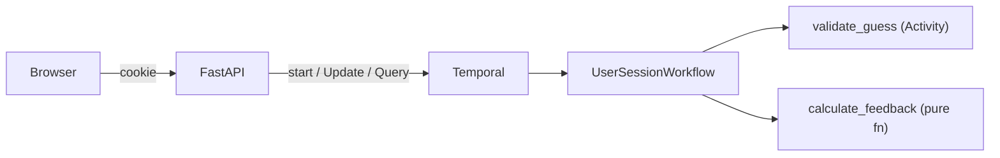

# Durable Wordle

A Wordle clone where each game session is a [Temporal](https://temporal.io) workflow. No database — the workflow *is* the state. Built as a conference demo teaching core Temporal concepts through a game everyone already knows how to play.

Close the browser, reopen it, and your game is still there. That's durable execution.

## What This Teaches

Durable Wordle demonstrates five Temporal concepts using a single, easy-to-follow codebase:

### 1. Starting a Workflow (`start_workflow`)

Each browser session starts a new Temporal workflow. The workflow ID is deterministic — `wordle-{date}-{session_id}` — so returning to the page reconnects you to the same game.

**Where to look:** `api.py` → `_get_or_start_workflow()`

### 2. Updates (`execute_update`)

Guesses are submitted via Temporal's Update primitive — a request/response interaction that durably mutates workflow state and returns a result. The Update handler validates the guess, runs an activity, calculates feedback, and updates the game board in a single atomic operation.

**Where to look:** `workflows.py` → `UserSessionWorkflow.make_guess()`

### 3. Queries (`query`)

The game board is rendered by querying the workflow for its current state. Queries are read-only — they can't change workflow state, which makes them safe to call at any time.

**Where to look:** `workflows.py` → `UserSessionWorkflow.get_game_state()`

### 4. Activities (`execute_activity`)

Word validation runs as a Temporal Activity. Activities are the escape hatch for non-deterministic operations — file I/O, API calls, database queries. Here, the activity checks the guess against a bundled word list. If the worker crashes mid-validation, Temporal retries the activity automatically.

**Where to look:** `activities.py` → `validate_guess()`

### 5. Durable Execution and Workflow Completion

The workflow holds game state in memory and waits (`workflow.wait_condition`) until the game ends. If the worker restarts, Temporal replays the workflow's event history to rebuild the exact same state — no data loss, no recovery code. When the player wins or loses, the workflow completes and returns the final game state.

**Where to look:** `workflows.py` → `UserSessionWorkflow.run()`

## Architecture



- **One workflow per game session** — cookie holds a session UUID, workflow ID = `wordle-{date}-{session_id}`
- **No database** — the workflow's event history is the source of truth
- **Deterministic daily word** — `random.seed(date.toordinal())` picks the same word for all players each day

## Prerequisites

- **Python 3.12+**
- **[uv](https://docs.astral.sh/uv/)** — Python package manager
- **[just](https://github.com/casey/just)** — task runner
- **[Temporal CLI](https://docs.temporal.io/cli)** — for the local dev server

### Install Temporal CLI

**macOS:**
```bash
brew install temporal
```

**Linux:**
```bash
# Download from https://temporal.download/cli/archive/latest?platform=linux&arch=amd64
# Extract and add `temporal` to your PATH
```

## Running Locally (without Docker)

You need three terminal windows:

### Terminal 1: Start Temporal dev server

```bash
temporal server start-dev
```

This starts a local Temporal server at `localhost:7233` with an ephemeral SQLite database and the Temporal UI at `http://localhost:8233`.

### Terminal 2: Start the worker

```bash
uv sync
just worker
```

The worker connects to Temporal and polls for workflow tasks. It registers the `UserSessionWorkflow` and the `validate_guess` activity.

### Terminal 3: Start the web server

```bash
just server
```

Open **http://localhost:8000** in your browser and play.

### Configuration

All settings are read from environment variables with sensible defaults for local development:

| Variable | Default | Description |
|---|---|---|
| `DURABLE_WORDLE_TEMPORAL_HOST` | `localhost:7233` | Temporal server address |
| `DURABLE_WORDLE_TEMPORAL_NAMESPACE` | `default` | Temporal namespace |
| `DURABLE_WORDLE_TEMPORAL_TASK_QUEUE` | `wordle-tasks` | Task queue name |

## Development

```bash
just check      # lint + typecheck + test (the gate)
just test       # run tests
just lint       # ruff check
just typecheck  # mypy strict
just format     # ruff format
```

Run a single test:
```bash
uv run pytest tests/test_game_logic.py::test_all_correct_letters -v
```

## Running with Docker Compose

If you'd rather not install Temporal locally, Docker Compose runs everything for you — Temporal server, worker, and web app:

```bash
docker compose up --build
```

Open **http://localhost:8000** to play. The Temporal UI is available at **http://localhost:8233**.

To stop:
```bash
docker compose down
```

## Tech Stack

- **Backend:** Temporal Python SDK, FastAPI, Jinja2
- **Frontend:** HTMX, Tailwind CSS (CDN)
- **Package management:** uv
- **Task runner:** just
