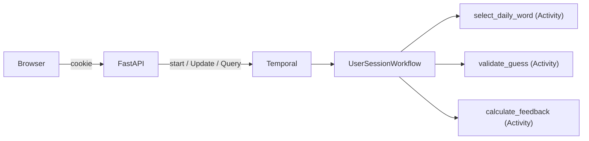

# Durable Wordle

A Wordle clone where each game session is a [Temporal](https://temporal.io) workflow. No database — the workflow *is* the state. Built as a conference demo teaching core Temporal concepts through a game everyone already knows how to play.

Close the browser, reopen it, and your game is still there. That's durable execution.

## What This Teaches

Durable Wordle demonstrates five Temporal concepts using a single, easy-to-follow codebase:

### 1. Starting a Workflow (`start_workflow`)

Each browser session starts a new Temporal workflow. The workflow ID is deterministic — `wordle-{date}-{session_id}` — so returning to the page reconnects you to the same game.

**Where to look:** `api.py` → `_get_or_start_workflow()`

### 2. Updates (`execute_update`)

Guesses are submitted via Temporal's Update primitive — a request/response interaction that durably mutates workflow state and returns a result. The Update handler validates the guess, runs activities for word validation and feedback calculation, and updates the game board. An Update validator rejects invalid input (wrong length, non-alphabetic, game already over) before anything is written to history.

**Where to look:** `workflow.py` → `UserSessionWorkflow.make_guess()`

### 3. Queries (`query`)

The game board is rendered by querying the workflow for its current state. Queries are read-only — they can't change workflow state, which makes them safe to call at any time.

**Where to look:** `workflow.py` → `UserSessionWorkflow.get_game_state()`

### 4. Activities (`execute_activity`)

Three activities demonstrate different use cases:

- **`validate_guess`** — checks the guess against a bundled word list (file I/O side effect)
- **`calculate_feedback`** — computes green/yellow/gray feedback per letter (recorded in event history for observability)
- **`select_daily_word`** — picks the daily word from a date seed (non-deterministic randomness)

Each activity appears as a distinct event in the workflow history, making every step of every guess inspectable in the Temporal UI.

**Where to look:** `activities.py`

### 5. Durable Execution and Workflow Completion

The workflow holds game state in memory and waits (`workflow.wait_condition`) until the game ends. If the worker restarts, Temporal replays the workflow's event history to rebuild the exact same state — no data loss, no recovery code. When the player wins or loses, the workflow completes and returns the final game state.

**Where to look:** `workflow.py` → `UserSessionWorkflow.run()`

## Architecture



- **One workflow per game session** — cookie holds a session UUID, workflow ID = `wordle-{date}-{session_id}`
- **No database** — the workflow's event history is the source of truth
- **Daily or random mode** — daily mode uses `workflow.now()` + an activity; random mode uses `workflow.random()` for deterministic replay
- **Fully playable via CLI** — the workflow is the complete game; the web UI is just a skin (see [Playing via Temporal CLI](#playing-via-temporal-cli))

## Prerequisites

- **Python 3.12+**
- **[uv](https://docs.astral.sh/uv/)** — Python package manager
- **[just](https://github.com/casey/just)** — task runner
- **[Temporal CLI](https://docs.temporal.io/cli)** — for the local dev server

### Install Temporal CLI

**macOS:**
```bash
brew install temporal
```

**Linux:**
```bash
# Download from https://temporal.download/cli/archive/latest?platform=linux&arch=amd64
# Extract and add `temporal` to your PATH
```

## Running Locally (without Docker)

You need three terminal windows:

### Terminal 1: Start Temporal dev server

```bash
temporal server start-dev
```

This starts a local Temporal server at `localhost:7233` with an ephemeral SQLite database and the Temporal UI at `http://localhost:8233`.

### Terminal 2: Start the worker

```bash
uv sync
just worker
```

The worker connects to Temporal and polls for workflow tasks. It registers the `UserSessionWorkflow` and all three activities.

### Terminal 3: Start the web server

```bash
just server
```

Open **http://localhost:8000** in your browser and play.

### Configuration

Connection settings use Temporal's standard [`envconfig`](https://docs.temporal.io/develop/environment-configuration) system — environment variables, TOML profiles, or both. Defaults work for local development out of the box.

| Variable | Default | Description |
|---|---|---|
| `TEMPORAL_ADDRESS` | `localhost:7233` | Temporal server address |
| `TEMPORAL_NAMESPACE` | `default` | Temporal namespace |
| `TEMPORAL_TASK_QUEUE` | `wordle-tasks` | Task queue name (app-specific) |

For Temporal Cloud, set `TEMPORAL_ADDRESS`, `TEMPORAL_NAMESPACE`, and `TEMPORAL_API_KEY` (or mTLS certs). See the [Temporal docs](https://docs.temporal.io/develop/python/temporal-client#connect-to-temporal-cloud) for details.

## Playing via Temporal CLI

The workflow is the complete game — you don't need the web UI. With a Temporal dev server and worker running, you can play entirely from the command line.

### Start a game (random word)

```bash
temporal workflow start \
  --type UserSessionWorkflow \
  --task-queue wordle-tasks \
  --workflow-id wordle-cli-game \
  --input '{"session_id": "cli-test", "random_mode": true}'
```

### Make a guess

```bash
temporal workflow update \
  --workflow-id wordle-cli-game \
  --name make_guess \
  --input '{"guess": "CRANE"}'
```

The response shows the feedback for each letter:

```json
{"word": "CRANE", "feedback": ["absent", "absent", "absent", "absent", "correct"]}
```

### Check the board

```bash
temporal workflow query \
  --workflow-id wordle-cli-game \
  --name get_game_state
```

Returns the full game state — target word, all guesses with feedback, status, and remaining guesses.

### View the event history

```bash
temporal workflow show --workflow-id wordle-cli-game
```

Every step is visible: the word selection activity, each guess's validation and feedback activities, and the final game result.

### Start a daily game (same word for everyone)

```bash
temporal workflow start \
  --type UserSessionWorkflow \
  --task-queue wordle-tasks \
  --workflow-id wordle-daily-$(date +%Y-%m-%d)-player1 \
  --input '{"session_id": "player1"}'
```

Omitting `random_mode` (or setting it to `false`) uses the daily word — determined by `workflow.now()` and an activity, so every player on the same day gets the same word.

## Development

```bash
just check      # lint + typecheck + test (the gate)
just test       # run tests
just lint       # ruff check
just typecheck  # mypy strict
just format     # ruff format
```

Run a single test:
```bash
uv run pytest tests/test_game_logic.py::test_all_correct_letters -v
```

## Running with Docker Compose

If you'd rather not install Temporal locally, Docker Compose runs everything for you — Temporal server, worker, and web app:

```bash
docker compose up --build
```

Open **http://localhost:8000** to play. The Temporal UI is available at **http://localhost:8233**.

To stop:
```bash
docker compose down
```

## Tech Stack

- **Backend:** Temporal Python SDK, FastAPI, Jinja2
- **Frontend:** HTMX, Tailwind CSS (CDN)
- **Package management:** uv
- **Task runner:** just
