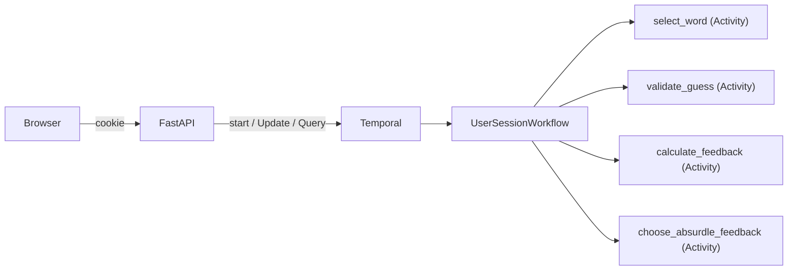

# Durable Wordle

<p align="center">
  <a href="https://t.mp/durable-wordle"></a>
</p>

A Wordle clone where each game session is a [Temporal](https://temporal.io)
workflow. No database - the workflow *is* the state. Built as a conference demo
teaching core Temporal concepts through a game everyone already knows how to
play.

Close the browser, reopen it, and your game is still there. That's durable
execution.

`just dev` runs the teachable classic game: a board-first Wordle with Daily,
Random, and Absurdle modes. The conference booth experience is documented
separately in [docs/booth/README.md](docs/booth/README.md) so the main learning
path stays focused on Temporal.

## Modes

The app runs in one of two modes, selected by the `DURABLE_WORDLE_APP_MODE`
environment variable.

**Classic (the default).**
A plain, board-first Wordle: open the page and play.
No sign-up, no lead capture, no database.
This is what you get when the variable is unset, so a fresh `git clone` followed
by `just dev`, `just ui`, or `docker compose up` runs classic.
If you just want the Temporal Wordle demo, you never touch this variable.
The board carries a Daily / Random / Absurdle selector, and it defaults to
**Daily** (the date-seeded word everyone gets that day). Pick Random for a new
word each game, or Absurdle for the adversarial variant.

**Booth.**
The conference-booth experience layered on top of the same workflow: a lead-capture
start screen (name, email, madlib), a SQLite leaderboard, a second-screen display,
and a reverse proxy for the Temporal UI.
Opt in with `just booth`, or set `DURABLE_WORDLE_APP_MODE=booth` (for example in the
`docker-compose.yml` `web` service).
See [docs/booth/README.md](docs/booth/README.md) for the full setup.

Both modes run the identical `UserSessionWorkflow`. The mode only changes the web
skin and the booth-only extras; the game itself lives in the workflow either way.

## Temporal Concepts Demonstrated

| Concept | What It Does Here | Where to Look |
|---|---|---|
| **Start Workflow** | Each session starts a workflow; deterministic IDs reconnect returning players | `api.py` -> `_get_or_start_workflow()` |
| **Updates** | Guesses mutate workflow state and return feedback; a validator rejects bad input before history is written | `workflow.py` -> `make_guess()` |
| **Queries** | Read-only game board retrieval, safe to call any time | `workflow.py` -> `get_game_state()` |
| **Activities** | Word selection, guess validation, feedback calculation, and Absurdle partitioning - each visible in event history | `activities.py` |
| **Durable Execution** | Workflow holds state in memory; worker restarts replay history to rebuild state with zero data loss | `workflow.py` -> `run()` |
| **Workflow Completion** | The workflow completes when the player wins or loses | `workflow.py` -> `run()` |

## Architecture


```mermaid
flowchart LR
    Browser -->|cookie| FastAPI
    FastAPI -->|start / Update / Query| Temporal
    Temporal --> UserSessionWorkflow
    UserSessionWorkflow --> select_word["select_word (Activity)"]
    UserSessionWorkflow --> validate_guess["validate_guess (Activity)"]
    UserSessionWorkflow --> calculate_feedback["calculate_feedback (Activity)"]
    UserSessionWorkflow --> choose_absurdle_feedback["choose_absurdle_feedback (Activity)"]
```

- **One workflow per game session** - cookie state chooses a deterministic
  workflow ID for Daily, Random, or Absurdle mode.
- **The workflow is the game state** - event history is the source of truth; the
  web UI is only a skin.
- **Multiple game modes** - Daily and Random select a target word up front;
  Absurdle keeps candidate state in the workflow and delays choosing a final
  answer.
- **Fully playable via CLI** - the workflow is the complete game; see
  [Playing via Temporal CLI](#playing-via-temporal-cli).

### Absurdle Mode

Absurdle follows [qntm's original algorithm](https://qntm.org/absurdle). The
workflow does not pick a secret word up front. Instead, each guess calls the
`choose_absurdle_feedback` activity, which:

1. partitions the remaining answer candidates by the Wordle feedback they would
   produce for that guess,
2. chooses the largest partition to discard as little information as possible,
3. uses deterministic tie-breakers that prefer fewer green and yellow letters,
4. stores the selected partition back in workflow state as
   `remaining_candidates`.

When only one answer remains, Absurdle behaves like normal Wordle until the
player guesses that word or runs out of attempts.

## Prerequisites

- **Python 3.12+**
- **[uv](https://docs.astral.sh/uv/)** - Python package manager
- **[just](https://github.com/casey/just)** - task runner
- **[Temporal CLI](https://docs.temporal.io/cli)** - for the local dev server

### Install Temporal CLI

**macOS:**

```bash
brew install temporal
```

**Linux:**

```bash
# Download from https://temporal.download/cli/archive/latest?platform=linux&arch=amd64
# Extract and add `temporal` to your PATH
```

## Running Locally

The easiest path is one command:

```bash
uv sync
just dev
```

This starts the Temporal dev server, waits for it to become healthy, then runs
the worker and FastAPI web server in **classic** mode. Ctrl-C stops all three.

Open **http://localhost:8000** to play. The Temporal UI is at
**http://localhost:8233** and the health check is at
**http://localhost:8000/health**.

If you'd rather run each process separately, use three terminal windows:

### Terminal 1: Start Temporal dev server

```bash
just server
```

This starts a local Temporal server at `localhost:7233` with an ephemeral SQLite
database and the Temporal UI at `http://localhost:8233`.

### Terminal 2: Start the worker

```bash
uv sync
just worker
```

The worker connects to Temporal and polls for workflow tasks. It registers the
`UserSessionWorkflow` and the activities used by each game mode.

### Terminal 3: Start the web server

```bash
just ui
```

Open **http://localhost:8000** in your browser and play.

### Configuration

Connection settings use Temporal's standard
[`envconfig`](https://docs.temporal.io/develop/environment-configuration) system
- environment variables, TOML profiles, or both. Defaults work for local
development out of the box.

| Variable | Default | Description |
|---|---|---|
| `TEMPORAL_ADDRESS` | `localhost:7233` | Temporal server address |
| `TEMPORAL_NAMESPACE` | `default` | Temporal namespace |
| `TEMPORAL_TASK_QUEUE` | `wordle-tasks` | Task queue name (app-specific) |
| `DURABLE_WORDLE_APP_MODE` | `classic` | Runtime mode: `classic` or `booth` (see [Modes](#modes)) |

For Temporal Cloud, set `TEMPORAL_ADDRESS`, `TEMPORAL_NAMESPACE`, and
`TEMPORAL_API_KEY` (or mTLS certs). See the
[Temporal docs](https://docs.temporal.io/develop/python/temporal-client#connect-to-temporal-cloud)
for details.

## Playing via Temporal CLI

The workflow is the complete game - you don't need the web UI. With a Temporal
dev server and worker running, you can play entirely from the command line.

### Start a game

```bash
temporal workflow start \
  --type UserSessionWorkflow \
  --task-queue wordle-tasks \
  --workflow-id wordle-cli-game \
  --input '{"session_id": "cli-test", "game_mode": "random"}'
```

Use `"game_mode": "daily"` for a daily game or `"game_mode": "absurdle"` for
Absurdle.

### Make a guess

```bash
temporal workflow update \
  --workflow-id wordle-cli-game \
  --name make_guess \
  --input '{"guess": "CRANE"}'
```

The response shows the feedback for each letter:

```json
{"word": "CRANE", "feedback": ["absent", "absent", "absent", "absent", "correct"]}
```

### Check the board

```bash
temporal workflow query \
  --workflow-id wordle-cli-game \
  --name get_game_state
```

Returns the full game state - target word, all guesses with feedback, status,
and remaining guesses.

### View the event history

```bash
temporal workflow show --workflow-id wordle-cli-game
```

Every step is visible: the word selection activity, each guess's validation and
feedback activities, Absurdle candidate partitioning when enabled, and the final
game result.

## Development

```bash
just check      # lint + typecheck + test (the gate)
just dev        # classic board-first Wordle for learning the codebase
just server     # start Temporal local dev server
just worker     # start Temporal worker
just ui         # start FastAPI web server
just test       # run tests
just test-e2e   # full-stack browser smoke tests (Playwright)
just build-css  # rebuild static/tailwind.css from templates/JS
just lint       # ruff check
just typecheck  # mypy strict
just format     # ruff format
```

The default gate excludes the browser **e2e** tests. To run them once:

```bash
uv sync
uv run playwright install chromium   # one-time browser download
just test-e2e                        # boots Temporal + worker + app, drives Chromium
```

Run a single test:

```bash
uv run pytest tests/test_game_logic.py::test_all_correct_letters -v
```

## Running with Docker Compose

If you'd rather not install Temporal locally, Docker Compose runs everything for
you - Temporal server, worker, and web app:

```bash
docker compose up --build
```

Open **http://localhost:8000** to play. The Temporal UI is available at
**http://localhost:8233**.

This runs classic mode by default. To run the booth experience instead, set
`DURABLE_WORDLE_APP_MODE=booth` on the `web` service in `docker-compose.yml`.

To stop:

```bash
docker compose down
```

## Tech Stack

- **Backend:** Temporal Python SDK, FastAPI, Jinja2
- **Frontend:** HTMX, Tailwind CSS (prebuilt + committed, no CDN - works
  offline), Space Mono
- **Package management:** uv
- **Task runner:** just
