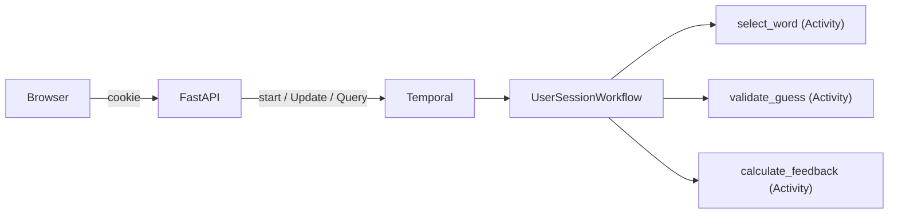

# Durable Wordle

<p align="center">
  <a href="https://t.mp/durable-wordle"></a>
</p>

A Wordle clone where each game session is a [Temporal](https://temporal.io) workflow. No database — the workflow *is* the state. Built as a conference demo teaching core Temporal concepts through a game everyone already knows how to play.

Close the browser, reopen it, and your game is still there. That's durable execution.

The booth experience adds a madlib start screen, a SQLite-backed leaderboard (the only persistence — used for scores and prize outreach, never for game state), and a [second-screen "holographic" display](#second-screen-holographic-display) that shows the live Temporal workflow timeline while someone plays and cycles fun animations when idle.

## Temporal Concepts Demonstrated

| Concept | What It Does Here | Where to Look |
|---|---|---|
| **Start Workflow** | Each session starts a workflow; deterministic ID reconnects returning players | `api.py` → `_get_or_start_workflow()` |
| **Updates** | Guesses mutate workflow state and return feedback; a validator rejects bad input before history is written | `workflow.py` → `make_guess()` |
| **Queries** | Read-only game board retrieval, safe to call any time | `workflow.py` → `get_game_state()` |
| **Activities** | Word selection, guess validation (dictionary API), and feedback calculation — each visible in event history | `activities.py` |
| **Durable Execution** | Workflow holds state in memory; worker restarts replay history to rebuild state with zero data loss | `workflow.py` → `run()` |
| **Workflow Completion** | The workflow completes when the player wins, loses, or goes idle past the inactivity timeout — then it's no longer `RUNNING` | `workflow.py` → `run()` |

## Architecture


```mermaid
flowchart LR
    Browser -->|cookie| FastAPI
    FastAPI -->|start / Update / Query| Temporal
    Temporal --> UserSessionWorkflow
    UserSessionWorkflow --> select_word["select_word (Activity)"]
    UserSessionWorkflow --> validate_guess["validate_guess (Activity)"]
    UserSessionWorkflow --> calculate_feedback["calculate_feedback (Activity)"]
```

- **One workflow per game session** — cookie holds a session UUID; workflow ID is `wordle-{date}-{session_id}` (or `wordle-random-{game_id}`)
- **The workflow is the game state** — event history is the source of truth; the only database is a small SQLite leaderboard for scores
- **Random word per game** — `select_word` picks a random answer; the workflow uses `workflow.random()`/`workflow.now()` for deterministic replay
- **Inactivity timeout** — a game with no guesses for 60s completes as `abandoned`, so the booth display returns to idle and stale workflows don't pile up
- **Fully playable via CLI** — the workflow is the complete game; the web UI is just a skin (see [Playing via Temporal CLI](#playing-via-temporal-cli))

## Prerequisites

- **Python 3.12+**
- **[uv](https://docs.astral.sh/uv/)** — Python package manager
- **[just](https://github.com/casey/just)** — task runner
- **[Temporal CLI](https://docs.temporal.io/cli)** — for the local dev server

### Install Temporal CLI

**macOS:**
```bash
brew install temporal
```

**Linux:**
```bash
# Download from https://temporal.download/cli/archive/latest?platform=linux&arch=amd64
# Extract and add `temporal` to your PATH
```

## Running Locally (without Docker)

The easiest path is one command:

```bash
uv sync
just dev
```

This starts the Temporal dev server, waits for it to become healthy, then runs the worker and FastAPI web server together — Ctrl-C stops all three. Open **http://localhost:8000** to play; the Temporal UI is at **http://localhost:8233** and the health check at **http://localhost:8000/health**.

If you'd rather run each process separately, use three terminal windows:

### Terminal 1: Start Temporal dev server

```bash
just server
```

This starts a local Temporal server at `localhost:7233` with an ephemeral SQLite database and the Temporal UI at `http://localhost:8233`.

### Terminal 2: Start the worker

```bash
uv sync
just worker
```

The worker connects to Temporal and polls for workflow tasks. It registers the `UserSessionWorkflow` and all three activities.

### Terminal 3: Start the web server

```bash
just ui
```

Open **http://localhost:8000** in your browser and play.

### Configuration

Connection settings use Temporal's standard [`envconfig`](https://docs.temporal.io/develop/environment-configuration) system — environment variables, TOML profiles, or both. Defaults work for local development out of the box.

| Variable | Default | Description |
|---|---|---|
| `TEMPORAL_ADDRESS` | `localhost:7233` | Temporal server address |
| `TEMPORAL_NAMESPACE` | `default` | Temporal namespace |
| `TEMPORAL_TASK_QUEUE` | `wordle-tasks` | Task queue name (app-specific) |

For Temporal Cloud, set `TEMPORAL_ADDRESS`, `TEMPORAL_NAMESPACE`, and `TEMPORAL_API_KEY` (or mTLS certs). See the [Temporal docs](https://docs.temporal.io/develop/python/temporal-client#connect-to-temporal-cloud) for details.

## Second Screen (Holographic Display)

Open **http://localhost:8000/display** in a second browser window for a companion screen designed for the booth's holographic fans (dark background, high contrast, centered content). `just booth` starts the whole stack and opens both the game and this display in Firefox kiosk windows.

**Calibration:** the display opens on a calibration overlay — concentric rings and a crosshair to align against the fan's visible circle, plus a width box previewing the timeline. Use the arrow keys (or on-screen D-pad) to re-center, `[`/`]` to resize, then **Save & Launch**. The values persist in `localStorage`, so on later launches you just confirm. Under the hood these map to CSS knobs (`--shift-x`, `--shift-y`, `--circle-w`).

Once launched it self-switches between two modes by polling `GET /api/active-game` every 2 seconds:

- **Attract mode** (no game running) — cycles a floating Ziggy + Temporal logo, the players' madlib phrases, and the live leaderboard.
- **Game mode** (a game is running) — shows only the live Temporal **workflow timeline**. The Temporal UI is same-origin-proxied under `/temporal-ui/` (the app strips `X-Frame-Options`/CSP so it can be embedded), and the page extracts just the timeline SVG from a hidden iframe, re-cloning it every 1.5s so it stays live as events arrive.

The display tracks the most recently started running workflow, and `POST /play` terminates any other running game so only one is ever active at the booth. When the game ends (win/loss/timeout), the display returns to attract mode automatically.

## Playing via Temporal CLI

The workflow is the complete game — you don't need the web UI. With a Temporal dev server and worker running, you can play entirely from the command line.

### Start a game (random word)

```bash
temporal workflow start \
  --type UserSessionWorkflow \
  --task-queue wordle-tasks \
  --workflow-id wordle-cli-game \
  --input '{"session_id": "cli-test"}'
```

### Make a guess

```bash
temporal workflow update \
  --workflow-id wordle-cli-game \
  --name make_guess \
  --input '{"guess": "CRANE"}'
```

The response shows the feedback for each letter:

```json
{"word": "CRANE", "feedback": ["absent", "absent", "absent", "absent", "correct"]}
```

### Check the board

```bash
temporal workflow query \
  --workflow-id wordle-cli-game \
  --name get_game_state
```

Returns the full game state — target word, all guesses with feedback, status, and remaining guesses.

### View the event history

```bash
temporal workflow show --workflow-id wordle-cli-game
```

Every step is visible: the word selection activity, each guess's validation and feedback activities, and the final game result.

Each game gets a random word via the `select_word` activity, so two sessions won't share an answer.

## Development

```bash
just check      # lint + typecheck + test (the gate)
just dev        # start Temporal server + worker + web UI together
just booth      # just dev + open the game and display in Firefox kiosk windows
just server     # start Temporal local dev server
just worker     # start Temporal worker
just ui         # start FastAPI web server
just test       # run tests
just lint       # ruff check
just typecheck  # mypy strict
just format     # ruff format
```

Run a single test:
```bash
uv run pytest tests/test_game_logic.py::test_all_correct_letters -v
```

## Running with Docker Compose

If you'd rather not install Temporal locally, Docker Compose runs everything for you — Temporal server, worker, and web app:

```bash
docker compose up --build
```

Open **http://localhost:8000** to play. The Temporal UI is available at **http://localhost:8233**.

To stop:
```bash
docker compose down
```

## Tech Stack

- **Backend:** Temporal Python SDK, FastAPI, Jinja2
- **Frontend:** HTMX, Tailwind CSS (CDN), Space Mono
- **Persistence:** SQLite — leaderboard scores only; game state lives in the workflow
- **Package management:** uv
- **Task runner:** just
